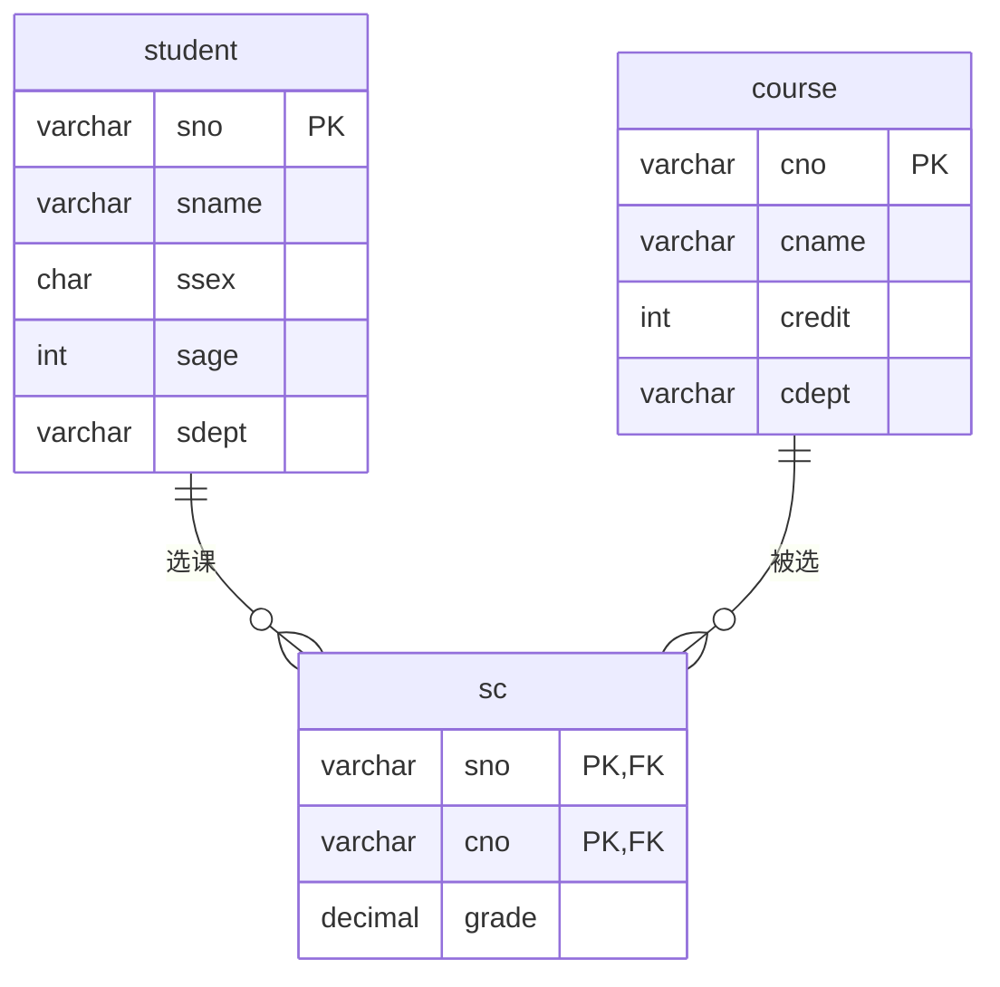

# 数据库设计文档

## 数据库概述

本项目使用MySQL 8.0数据库，数据库名为`springtest`。数据库采用UTF-8字符集，支持中文存储。

## 表结构设计

### 1. 学生表（student）

#### 表结构
```sql
CREATE TABLE student (
    sno VARCHAR(20) PRIMARY KEY,    -- 学号
    sname VARCHAR(50) NOT NULL,     -- 姓名
    ssex CHAR(2),                   -- 性别
    sage INT,                       -- 年龄
    sdept VARCHAR(50)              -- 院系
);
```

#### 字段说明
| 字段名 | 类型 | 长度 | 允许空 | 默认值 | 说明 |
|--------|------|------|--------|--------|------|
| sno | VARCHAR | 20 | 否 | 无 | 学号，主键 |
| sname | VARCHAR | 50 | 否 | 无 | 学生姓名 |
| ssex | CHAR | 2 | 是 | NULL | 性别 |
| sage | INT | - | 是 | NULL | 年龄 |
| sdept | VARCHAR | 50 | 是 | NULL | 院系 |

#### 索引
- 主键索引：sno

### 2. 课程表（course）

#### 表结构
```sql
CREATE TABLE course (
    cno VARCHAR(20) PRIMARY KEY,    -- 课程号
    cname VARCHAR(50) NOT NULL,     -- 课程名
    credit INT,                     -- 学分
    cdept VARCHAR(50)              -- 开课院系
);
```

#### 字段说明
| 字段名 | 类型 | 长度 | 允许空 | 默认值 | 说明 |
|--------|------|------|--------|--------|------|
| cno | VARCHAR | 20 | 否 | 无 | 课程号，主键 |
| cname | VARCHAR | 50 | 否 | 无 | 课程名称 |
| credit | INT | - | 是 | NULL | 学分 |
| cdept | VARCHAR | 50 | 是 | NULL | 开课院系 |

#### 索引
- 主键索引：cno

### 3. 选课表（sc）

#### 表结构
```sql
CREATE TABLE sc (
    sno VARCHAR(20),               -- 学号
    cno VARCHAR(20),               -- 课程号
    grade DECIMAL(5,2),            -- 成绩
    PRIMARY KEY (sno, cno),
    FOREIGN KEY (sno) REFERENCES student(sno),
    FOREIGN KEY (cno) REFERENCES course(cno)
);
```

#### 字段说明
| 字段名 | 类型 | 长度 | 允许空 | 默认值 | 说明 |
|--------|------|------|--------|--------|------|
| sno | VARCHAR | 20 | 否 | 无 | 学号，联合主键 |
| cno | VARCHAR | 20 | 否 | 无 | 课程号，联合主键 |
| grade | DECIMAL | 5,2 | 是 | NULL | 成绩 |

#### 索引
- 主键索引：(sno, cno)
- 外键索引：sno -> student(sno)
- 外键索引：cno -> course(cno)

## 数据库关系图



## 数据库配置

### 连接配置
```properties
spring.datasource.url=jdbc:mysql://localhost:3306/springtest?useUnicode=true&characterEncoding=UTF-8&allowMultiQueries=true&serverTimezone=GMT%2B8
spring.datasource.username=root
spring.datasource.password=123456
spring.datasource.driver-class-name=com.mysql.cj.jdbc.Driver
```

### 数据库参数
- 数据库名：springtest
- 字符集：utf8mb4
- 排序规则：utf8mb4_unicode_ci
- 端口：3306
- 时区：GMT+8

## 初始化脚本

```sql
-- 创建数据库
CREATE DATABASE springtest CHARACTER SET utf8mb4 COLLATE utf8mb4_unicode_ci;
USE springtest;

-- 创建学生表
CREATE TABLE student (
    sno VARCHAR(20) PRIMARY KEY,
    sname VARCHAR(50) NOT NULL,
    ssex CHAR(2),
    sage INT,
    sdept VARCHAR(50)
);

-- 创建课程表
CREATE TABLE course (
    cno VARCHAR(20) PRIMARY KEY,
    cname VARCHAR(50) NOT NULL,
    credit INT,
    cdept VARCHAR(50)
);

-- 创建选课表
CREATE TABLE sc (
    sno VARCHAR(20),
    cno VARCHAR(20),
    grade DECIMAL(5,2),
    PRIMARY KEY (sno, cno),
    FOREIGN KEY (sno) REFERENCES student(sno),
    FOREIGN KEY (cno) REFERENCES course(cno)
);
```

## 测试数据

```sql
-- 插入学生数据
INSERT INTO student VALUES
('2024001', '张三', '男', 20, '计算机系'),
('2024002', '李四', '女', 19, '数学系'),
('2024003', '王五', '男', 21, '物理系');

-- 插入课程数据
INSERT INTO course VALUES
('C001', '计算机网络', 4, '计算机系'),
('C002', '高等数学', 5, '数学系'),
('C003', '大学物理', 4, '物理系');

-- 插入选课数据
INSERT INTO sc VALUES
('2024001', 'C001', 85.5),
('2024001', 'C002', 90.0),
('2024002', 'C001', 88.0),
('2024003', 'C003', 92.5);
```

## 注意事项

1. 所有表名和字段名使用小写字母
2. 主键字段使用有意义的名称
3. 外键关系需要建立索引
4. 字符串类型字段使用VARCHAR
5. 时间类型字段使用DATETIME
6. 数值类型字段根据实际需求选择
7. 所有表都需要包含创建时间和更新时间字段
8. 重要字段需要添加注释
9. 需要建立适当的索引提高查询效率
10. 注意数据完整性约束 